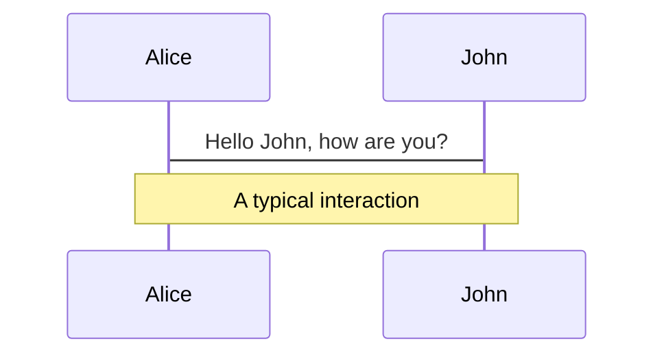
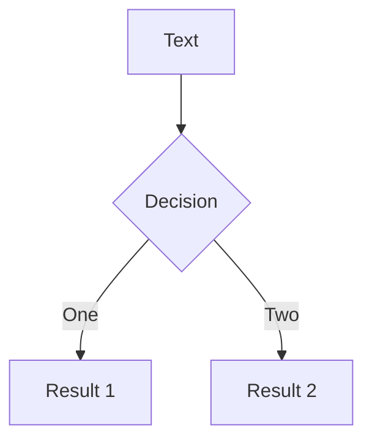
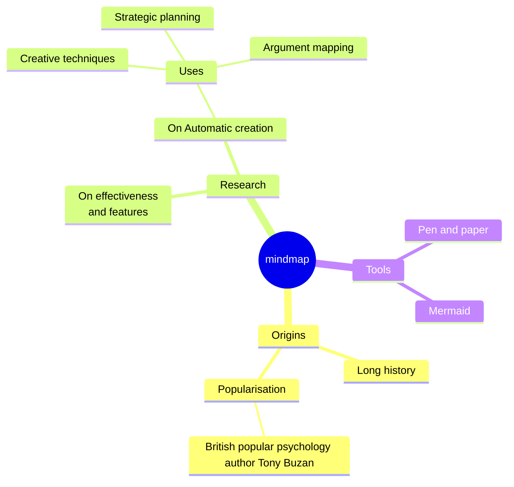
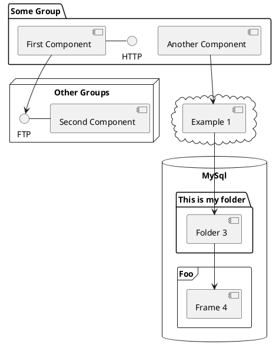

---
# try also 'default' to start simple
theme: seriph
# random image from a curated Unsplash collection by Anthony
# like them? see https://unsplash.com/collections/94734566/slidev
background: https://www.sitepen.com/typescript-code-blocks.34Qg3nlF.svg
# background: https://img-c.udemycdn.com/course/750x422/986406_89c5_3.jpg
# some information about your slides, markdown enabled
title: Welcome to Slidev
info: |
  ## Slidev Starter Template
  Presentation slides for developers.

  Learn more at [Sli.dev](https://sli.dev)
# apply any unocss classes to the current slide
class: text-center
# https://sli.dev/custom/highlighters.html
highlighter: shiki
# https://sli.dev/guide/drawing
drawings:
  persist: false
# slide transition: https://sli.dev/guide/animations#slide-transitions
transition: slide-left
# enable MDC Syntax: https://sli.dev/guide/syntax#mdc-syntax
mdc: true
---

# 

<div class="abs-br h-fit flex">
  <a href="https://github.com/tony-hagen/TypescriptFagDag" target="_blank" alt="GitHub" title="Open in GitHub"
    class="text-xl slidev-icon-btn opacity-50 !border-none !hover:text-white">
    <carbon-logo-github /> GitHub repo
  </a>
</div>

<!--
The last comment block of each slide will be treated as slide notes. It will be visible and editable in Presenter Mode along with the slide. [Read more in the docs](https://sli.dev/guide/syntax.html#notes)
-->

---
transition: slide-down
---

# Foredragsholdere 

<div class="flex gap-20 mt-20">
    <div class="flex flex-col gap-3">
        
        <span class="text-md">Tony Hagen</span>
        <p class="text-sm">Senior frontend-utvikler, mentor, disc golf entusiast. Mest erfaring med React, Typescript og Angular.</p>
    </div>
    <div class="flex flex-col gap-3">
            
        <span class="text-md">Deividas Svaikauskas</span>
        <p class="text-sm">Bare frontend-utvikler, mentee (ikke Tony sin), volleyball pro wannabe. Mest erfaring med React, Typescript og Vue.</p>
    </div>
</div>

---
transition: fade-out
layout: two-cols
---

# Utility Types

```ts {*|2|3-6|*} twoslash

interface Todo {
  title: string;
  description: string;
  completed: boolean;
  createdAt: number;
}
```

<div v-after class="grid grid-cols-2 gap-2 text-md mt-10">
    <span>Partial</span>
    <span>Required</span>
    <span>Readonly</span>
    <span>Record</span>
    <span>Pick</span>
    <span>Omit</span>
    <span>Union Types</span>
    <span>Awaited</span>
</div>

::right::


---
transition: fade-out
---

## Partial - Husk å fjerne kommentarene
```ts {2-6|2-16|18-20|22-24} twoslash

type Person = {
    name: string;
    age: number;
    email: string;
};

// En funksjon som oppretter en ny person med valgfrie egenskaper
function createPerson(data: Partial<Person>): Person {
    // Vi kombinerer det partielle objektet med en standardperson for å sikre at alle nødvendige egenskaper er der
    return {
        name: data.name || "Unknown",
        age: data.age || 0,
        email: data.email || "unknown@example.com",
    };
}

// Eksempel på bruk av createPerson-funksjonen med delvis informasjon
const person1 = createPerson({ name: "John" });
console.log(person1); // Output: { name: 'John', age: 0, email: 'unknown@example.com' }

// Eksempel på bruk av createPerson-funksjonen med full informasjon
const person2 = createPerson({ name: "Alice", age: 30, email: "alice@example.com" });
console.log(person2); // Output: { name: 'Alice', age: 30, email: 'alice@example.com' }
```

---
transition: fade-out
---
## Required
```ts {1-6|8-14|16-22} twoslash
// Definisjon av en delvis Person-objekttype med noen egenskaper valgfrie
type PartialPerson = {
    name?: string;
    age?: number;
    email?: string;
};

// Definisjon av en obligatorisk Person-objekttype med alle egenskapene påkrevd
type RequiredPerson = Required<PartialPerson>;

// En funksjon som oppretter en ny person med obligatoriske egenskaper
function createRequiredPerson(data: RequiredPerson): RequiredPerson {
    return data;
}

// Eksempel på bruk av createRequiredPerson-funksjonen med full informasjon
const person1: RequiredPerson = createRequiredPerson({ name: "John", age: 30, email: "john@example.com" });
console.log(person1); // Output: { name: 'John', age: 30, email: 'john@example.com' }

// Eksempel på bruk av createRequiredPerson-funksjonen med manglende informasjon
// Dette vil resultere i en TypeScript-feil fordi alle egenskapene er påkrevd
// const person2: RequiredPerson = createRequiredPerson({ name: "Alice" });
```

---
transition: fade-out
---
## Readonly

```ts {1-6|8-16|18-25} twoslash
// Definisjon av en Person-objekttype med egenskaper som navn, alder og e-post
type Person = {
    readonly name: string;
    readonly age: number;
    readonly email: string;
};

// En funksjon som oppretter en ny person med angitte egenskaper
function createPerson(name: string, age: number, email: string): Person {
    // Returnerer en ny person med angitte egenskaper
    return {
        name,
        age,
        email,
    };
}

// Opprett en ny person
const person1: Person = createPerson("John", 30, "john@example.com");

// Forsøk på å endre egenskapen til en readonly-egenskap vil føre til en TypeScript-feil
// person1.name = "Alice"; // Dette vil resultere i en feil: Cannot assign to 'name' 
//because it is a read-only property.

console.log(person1); // Output: { name: 'John', age: 30, email: 'john@example.com' }
```

---
transition: fade-out
---
## Record

```ts {1-11|13-18|20-25} twoslash
// Definisjon av en Record-type som inneholder et ordforråd der nøkler er ord og verdier er definisjoner
type Vocabulary = Record<string, string>;

// En funksjon som søker etter definisjonen av et gitt ord i ordboken
function findDefinition(word: string, vocabulary: Vocabulary): string {
    if (vocabulary[word]) {
        return vocabulary[word];
    } else {
        return "Definition not found.";
    }
}

// Et eksempel på et ordforråd
const dictionary: Vocabulary = {
    "apple": "A fruit with a rounded shape, typically red, yellow, or green skin, and crisp flesh.",
    "banana": "A long curved fruit that grows in clusters and has soft pulpy flesh and yellow skin when ripe.",
    "orange": "A round juicy citrus fruit with a tough bright reddish-yellow rind.",
};

// Søk etter definisjonen av et ord i ordboken
console.log(findDefinition("apple", dictionary)); 
// Output: A fruit with a rounded shape, typically red, yellow, or green skin, and crisp flesh.
console.log(findDefinition("banana", dictionary)); 
// Output: A long curved fruit that grows in clusters and has soft pulpy flesh and yellow skin when ripe.
console.log(findDefinition("grape", dictionary)); // Output: Definition not found.
```

---
transition: fade-out
---
## Pick

```ts {1-7|9-21|23} twoslash
interface Person {
    name: string;
    age: number;
    email: string;
    address: string;
}
type GrunnleggendeInfo = Pick<Person, "name" | "email">;

function visGrunnleggendeInfo(info: GrunnleggendeInfo): void {
    console.log(`Navn: ${info.name}, E-post: ${info.email}`);
}
const person: Person = {
    name: "Ola Nordmann",
    age: 30,
    email: "ola@example.com",
    address: "Gateveien 123, Enhverby"
};
const grunnleggendeInfo: GrunnleggendeInfo = {
    name: person.name,
    email: person.email
};

visGrunnleggendeInfo(grunnleggendeInfo); // Output: Navn: Ola Nordmann, E-post: ola@example.com
```

---
transition: fade-out
---
## Omit

```ts {1-8|10-14|16-22} twoslash
interface Person {
    name: string;
    age: number;
    email: string;
    address: string;
}
type PersonligInfo = Omit<Person, "age" | "address">;

function visPersonligInfo(info: PersonligInfo): void {
    console.log(`Navn: ${info.name}, E-post: ${info.email}`);
}

const person: Person = {
    name: "Ola Nordmann",
    age: 30,
    email: "ola@example.com",
    address: "Gateveien 123, Enhverby"
};
const personligInfo: PersonligInfo = {
    name: person.name,
    email: person.email
};

visPersonligInfo(personligInfo); // Output: Navn: Ola Nordmann, E-post: ola@example.com
```

---
transition: fade-out
---
## Union Types

```ts {2-7|9-14|16-22} twoslash
// Unionstype som representerer forskjellige typer biler
type Car = "Sedan" | "SUV" | "Truck" | "Van" | "Convertible";

// Type som utelukker "Truck" og "Van" fra Car-unionen
type NonCommercialCar = Exclude<Car, "Truck" | "Van">;

// Resultatet vil være "Sedan" | "SUV" | "Convertible"

// Type som kun inkluderer "Sedan" og "Convertible" fra Car-unionen
type LuxuryCar = Extract<Car, "Sedan" | "Convertible">;

// Resultatet vil være "Sedan" | "Convertible"
```

---
transition: fade-out
---
## Awaited

```ts {2-7|9-14|16-22} twoslash
async function fetchUserData(): Promise<{ name: string; age: number }> {
    // Anta at dette er en API-forespørsel som henter brukerdata
    return new Promise(resolve => {
        setTimeout(() => {
            resolve({ name: "John Doe", age: 30 });
        }, 2000); // Simulerer en 2 sekunders forsinkelse
    });
}

// Definerer en type som representerer dataene som returneres fra fetchUserData-funksjonen når vi venter på resultatet
type UserData = Awaited<ReturnType<typeof fetchUserData>>;

// Vi bruker Awaited for å få typen av det som blir returnert når vi venter på fetchData-funksjonen
```

---
transition: fade-out
---

# TEST TEST

```ts {*|5|7|*} twoslash
// TwoSlash enables TypeScript hover information
// and errors in markdown code blocks
// More at https://shiki.style/packages/twoslash

type Test = number | 'zero'

const abc: Test = 12;
const bc: Test = 'zero';

```


<div>hello</div>

---
transition: fade-out
---

# What is Slidev?

Slidev is a slides maker and presenter designed for developers, consist of the following features

- 📝 **Text-based** - focus on the content with Markdown, and then style them later
- 🎨 **Themable** - theme can be shared and used with npm packages
- 🧑‍💻 **Developer Friendly** - code highlighting, live coding with autocompletion
- 🤹 **Interactive** - embedding Vue components to enhance your expressions
- 🎥 **Recording** - built-in recording and camera view
- 📤 **Portable** - export into PDF, PNGs, or even a hostable SPA
- 🛠 **Hackable** - anything possible on a webpage

<br>
<br>

Read more about [Why Slidev?](https://sli.dev/guide/why)

<!--
You can have `style` tag in markdown to override the style for the current page.
Learn more: https://sli.dev/guide/syntax#embedded-styles
-->

<style>
h1 {
  background-color: #2B90B6;
  background-image: linear-gradient(45deg, #4EC5D4 10%, #146b8c 20%);
  background-size: 100%;
  -webkit-background-clip: text;
  -moz-background-clip: text;
  -webkit-text-fill-color: transparent;
  -moz-text-fill-color: transparent;
}
</style>

<!--
Here is another comment.
-->

---
transition: slide-up
level: 2
---

# Navigation

Hover on the bottom-left corner to see the navigation's controls panel, [learn more](https://sli.dev/guide/navigation.html)

## Keyboard Shortcuts

|     |     |
| --- | --- |
| <kbd>right</kbd> / <kbd>space</kbd>| next animation or slide |
| <kbd>left</kbd>  / <kbd>shift</kbd><kbd>space</kbd> | previous animation or slide |
| <kbd>up</kbd> | previous slide |
| <kbd>down</kbd> | next slide |

<!-- https://sli.dev/guide/animations.html#click-animations -->

<p v-after class="absolute bottom-23 left-45 opacity-30 transform -rotate-10">Here!</p>

---
layout: two-cols
layoutClass: gap-16
---

# Table of contents

You can use the `Toc` component to generate a table of contents for your slides:

```html
<Toc minDepth="1" maxDepth="1"></Toc>
```

The title will be inferred from your slide content, or you can override it with `title` and `level` in your frontmatter.

::right::

<Toc v-click minDepth="1" maxDepth="2"></Toc>

---
layout: image-right
image: https://cover.sli.dev
---

# Code

Use code snippets and get the highlighting directly, and even types hover![^1]

```ts {all|5|7|7-8|10|all} twoslash
// TwoSlash enables TypeScript hover information
// and errors in markdown code blocks
// More at https://shiki.style/packages/twoslash

import { computed, ref } from 'vue'

const count = ref(0)
const doubled = computed(() => count.value * 2)

doubled.value = 2
```

<arrow v-click="[4, 5]" x1="350" y1="310" x2="195" y2="334" color="#953" width="2" arrowSize="1" />

<!-- This allow you to embed external code blocks -->
<<< @/snippets/external.ts#snippet

<!-- Footer -->
[^1]: [Learn More](https://sli.dev/guide/syntax.html#line-highlighting)

<!-- Inline style -->
<style>
.footnotes-sep {
  @apply mt-5 opacity-10;
}
.footnotes {
  @apply text-sm opacity-75;
}
.footnote-backref {
  display: none;
}
</style>

<!--
Notes can also sync with clicks

[click] This will be highlighted after the first click

[click] Highlighted with `count = ref(0)`

[click:3] Last click (skip two clicks)
-->

---
level: 2
---

# Shiki Magic Move

Powered by [shiki-magic-move](https://shiki-magic-move.netlify.app/), Slidev supports animations across multiple code snippets.

Add multiple code blocks and wrap them with <code>````md magic-move</code> (four backticks) to enable the magic move. For example:

````md magic-move
```ts {*|2|*}
// step 1
const author = reactive({
  name: 'John Doe',
  books: [
    'Vue 2 - Advanced Guide',
    'Vue 3 - Basic Guide',
    'Vue 4 - The Mystery'
  ]
})
```

```ts {*|1-2|3-4|3-4,8}
// step 2
export default {
  data() {
    return {
      author: {
        name: 'John Doe',
        books: [
          'Vue 2 - Advanced Guide',
          'Vue 3 - Basic Guide',
          'Vue 4 - The Mystery'
        ]
      }
    }
  }
}
```

```ts
// step 3
export default {
  data: () => ({
    author: {
      name: 'John Doe',
      books: [
        'Vue 2 - Advanced Guide',
        'Vue 3 - Basic Guide',
        'Vue 4 - The Mystery'
      ]
    }
  })
}
```

Non-code blocks are ignored.

```vue
<!-- step 4 -->
<script setup>
const author = {
  name: 'John Doe',
  books: [
    'Vue 2 - Advanced Guide',
    'Vue 3 - Basic Guide',
    'Vue 4 - The Mystery'
  ]
}
</script>
```
````

---

# Components

<div grid="~ cols-2 gap-4">
<div>

You can use Vue components directly inside your slides.

We have provided a few built-in components like `<Tweet/>` and `<Youtube/>` that you can use directly. And adding your custom components is also super easy.

```html
<Counter :count="10" />
```

<!-- ./components/Counter.vue -->
<Counter :count="10" m="t-4" />

Check out [the guides](https://sli.dev/builtin/components.html) for more.

</div>
<div>

```html
<Tweet id="1390115482657726468" />
```

<Tweet id="1390115482657726468" scale="0.65" />

</div>
</div>

<!--
Presenter note with **bold**, *italic*, and ~~striked~~ text.

Also, HTML elements are valid:
<div class="flex w-full">
  <span style="flex-grow: 1;">Left content</span>
  <span>Right content</span>
</div>
-->

---
class: px-20
---

# Themes

Slidev comes with powerful theming support. Themes can provide styles, layouts, components, or even configurations for tools. Switching between themes by just **one edit** in your frontmatter:

<div grid="~ cols-2 gap-2" m="t-2">

```yaml
---
theme: default
---
```

```yaml
---
theme: seriph
---
```


</div>

Read more about [How to use a theme](https://sli.dev/themes/use.html) and
check out the [Awesome Themes Gallery](https://sli.dev/themes/gallery.html).

---

# Clicks Animations

You can add `v-click` to elements to add a click animation.

<div v-click>

This shows up when you click the slide:

```html
<div v-click>This shows up when you click the slide.</div>
```

</div>

<br>

<v-click>

The <span v-mark.red="3"><code>v-mark</code> directive</span>
also allows you to add
<span v-mark.circle.orange="4">inline marks</span>
, powered by [Rough Notation](https://roughnotation.com/):

```html
<span v-mark.underline.orange>inline markers</span>
```

</v-click>

<div mt-20 v-click>

[Learn More](https://sli.dev/guide/animations#click-animations)

</div>

---

# Motions

Motion animations are powered by [@vueuse/motion](https://motion.vueuse.org/), triggered by `v-motion` directive.

```html
<div
  v-motion
  :initial="{ x: -80 }"
  :enter="{ x: 0 }"
  :click-3="{ x: 80 }"
  :leave="{ x: 1000 }"
>
  Slidev
</div>
```

<div class="w-60 relative">
  <div class="relative w-40 h-40">
    
    
    
  </div>

  <div
    class="text-5xl absolute top-14 left-40 text-[#2B90B6] -z-1"
    v-motion
    :initial="{ x: -80, opacity: 0}"
    :enter="{ x: 0, opacity: 1, transition: { delay: 2000, duration: 1000 } }">
    Slidev
  </div>
</div>

<!-- vue script setup scripts can be directly used in markdown, and will only affects current page -->
<script setup lang="ts">
const final = {
  x: 0,
  y: 0,
  rotate: 0,
  scale: 1,
  transition: {
    type: 'spring',
    damping: 10,
    stiffness: 20,
    mass: 2
  }
}
</script>

<div
  v-motion
  :initial="{ x:35, y: 30, opacity: 0}"
  :enter="{ y: 0, opacity: 1, transition: { delay: 3500 } }">

[Learn More](https://sli.dev/guide/animations.html#motion)

</div>

---

# LaTeX

LaTeX is supported out-of-box powered by [KaTeX](https://katex.org/).

<br>

Inline $\sqrt{3x-1}+(1+x)^2$

Block
$$ {1|3|all}
\begin{array}{c}

\nabla \times \vec{\mathbf{B}} -\, \frac1c\, \frac{\partial\vec{\mathbf{E}}}{\partial t} &
= \frac{4\pi}{c}\vec{\mathbf{j}}    \nabla \cdot \vec{\mathbf{E}} & = 4 \pi \rho \\

\nabla \times \vec{\mathbf{E}}\, +\, \frac1c\, \frac{\partial\vec{\mathbf{B}}}{\partial t} & = \vec{\mathbf{0}} \\

\nabla \cdot \vec{\mathbf{B}} & = 0

\end{array}
$$

<br>

[Learn more](https://sli.dev/guide/syntax#latex)

---

# Diagrams

You can create diagrams / graphs from textual descriptions, directly in your Markdown.

<div class="grid grid-cols-4 gap-5 pt-4 -mb-6">









</div>

[Learn More](https://sli.dev/guide/syntax.html#diagrams)

---
foo: bar
dragPos:
  square: 691,33,167,_,-16
---

# Draggable Elements

Double-click on the draggable elements to edit their positions.

<br>

###### Directive Usage

```md

```

<br>

###### Component Usage

```md
<v-drag text-3xl>
  <carbon:arrow-up />
  Use the `v-drag` component to have a draggable container!
</v-drag>
```

<v-drag pos="671,205,253,_,-15">
  <div text-center text-3xl border border-main rounded>
    Double-click me!
  </div>
</v-drag>


---
src: ./pages/multiple-entries.md
hide: false
---

---

# Monaco Editor

Slidev provides built-in Monaco Editor support.

Add `{monaco}` to the code block to turn it into an editor:

```ts {monaco}
import { ref } from 'vue'
import { emptyArray } from './external'

const arr = ref(emptyArray(10))
```

Use `{monaco-run}` to create an editor that can execute the code directly in the slide:

```ts {monaco-run}
import { version } from 'vue'
import { emptyArray, sayHello } from './external'

sayHello()
console.log(`vue ${version}`)
console.log(emptyArray<number>(10).reduce(fib => [...fib, fib.at(-1)! + fib.at(-2)!], [1, 1]))
```

---
layout: center
class: text-center
---

# Learn More

[Documentations](https://sli.dev) · [GitHub](https://github.com/slidevjs/slidev) · [Showcases](https://sli.dev/showcases.html)
